# Data-Analysis-for-Single-Photon-Calcium-Imaging-with-Deep-Learning
Affliated with Leibniz Institute for Neurobiology(LIN) Magdeburg and OVGU Magdeburg, we implemented data analysis for single photon calcium imaging with deep learning. This repo consisted of the work for deep learning team project under the guidance of Prof. Sebastian Stober from [AI Lab](https://ai.ovgu.de/), Faculty of Computer Science and Dr. Michael Lippert from [LIN](https://www.neuroscience-magdeburg.de/research/professor-jazz/michael-lippert/). 
```
Associated team members: Wai Po Kevin Teng, Praveen Putti and Lisa Schneider. 
```
Final report of this project can be viewed [[here](DeepCalciumImagingAnalysis_report.pdf)]

## Motivation
Calcium Imaging is a powerful method to simultaneously capture the activity of cells in the brain of rodents. Especially one-photon calcium imaging with head-mounted miniature
microscopes became increasingly popular since it allows the observation of freely behaving rodents. However, single-photon imaging data processing remains a challenging task due to missing depth information, background fluctuation, low image contrast, and movement artifacts. Distinct cells are not clearly delineated and might overlap with others. A novel deep learning architecture is proposed to detect cells within one-photon calcium imaging sessions. Our approach introduces learnable coordinates, that learn to locate themselves in the center of cell activations. Our deep learning framework is presented in an end-to-end unsupervised learning manner, given the lack of annotated data for each frame. The performance of the proposed method is benchmarked against manually annotated data, generated by two neuroscientists, that aggregates the occurrence of neurons over the whole session.

## Baseline 
Calcium images are captured via head-mounted miniature microscopes on rodents. These calcium images are preprocessed follow by annotation enhancement by domain experts using the CAVE tools, a GUI implementation in MatLab by [Tegtmeier et al](https://doi.org/10.3389/fnins.2018.00958). from LIN in order to retrieve region of interest(ROI). 
<p align="center">
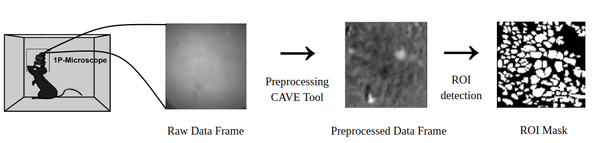
</p>

## Methods 
In our proposed model pipeline, we extensively implemented CoordConv by [Liu et al.](https://arxiv.org/abs/1807.03247) to capture the essence of positional features in the pixel space, hypothesising that this method would aid the allocation of neuron activation in the calcium images along the time frame. A schematic plot of CoordConv is as depicted below where the feature maps are concated with two positional features at the end of the channel before convolution operation.  
<p align="center">
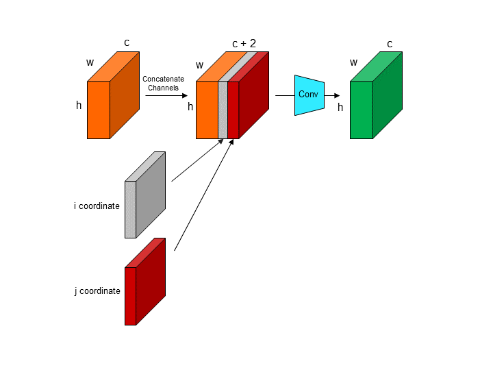
</p>

## Model 
Since this is an unsupervised learning task, our team adopted an autoencoder inspired model architecture in the hope to learn the neuron activations from calcium imaging via reconstruction. The output of various pipeline in the model are as shown below. 

<p align="center">
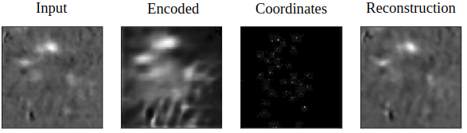
</p>

- Complete model pipeline (below): 
On the left-hand side, the model consists of an encoder network, aiming to enhance the input images’ signal-to-noise ratio. On the right-hand side, there is
pre-trained De-CoordConv network, which generates a sparse visualization of all learnable coordinates. The similarity scores are obtained at the bottleneck layer of this network by computing the dot product between the encoder output and the learnable coordinates’ sparse visualization. The latent space is constructed by concatenating the learnable coordinates with their similarity scores. The decoder reconstructs the input image from the latent space.

<p align="center">
  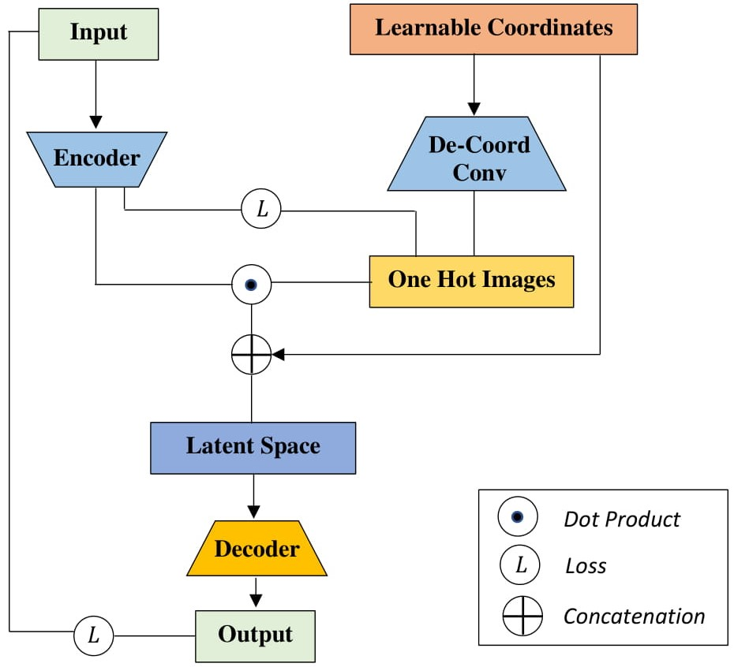
</p>

- Encoder network (below): 

<p align="center">
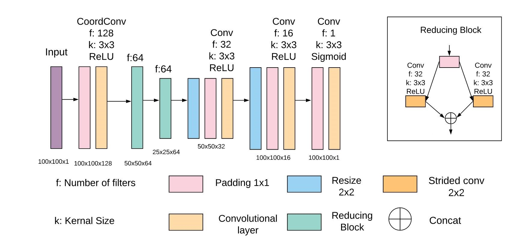
</p>

- Decoder network (below):
<p align="center">
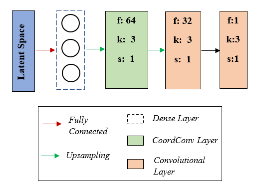
</p>

## Results 
The red dots represent the learnt pixel coordinates from the model throughout the training process where the red dots are summed along the time axis to show the neuron activations throughout a session. The white patches at the background are essentially the annotated groundtruth provided.  
|Session DG-13-3-8-17|Session DG-13-7-12-17|Session DG-13-8-11-17|
|:--:|:--:|:--:|
|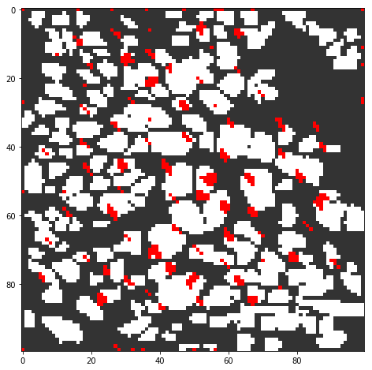|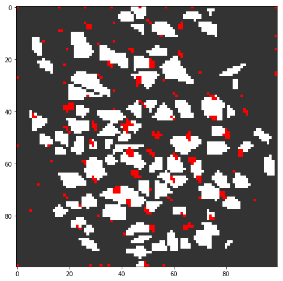|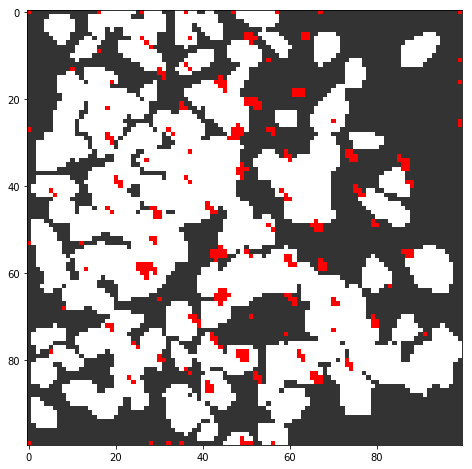|
|Session DG-13-8-16-17|Session DG-13-8-18-17|Session DG-13-8-8-17|
|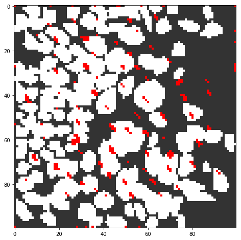|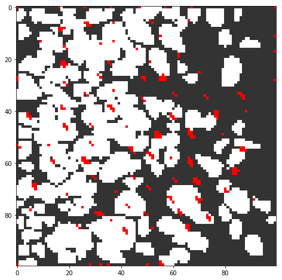|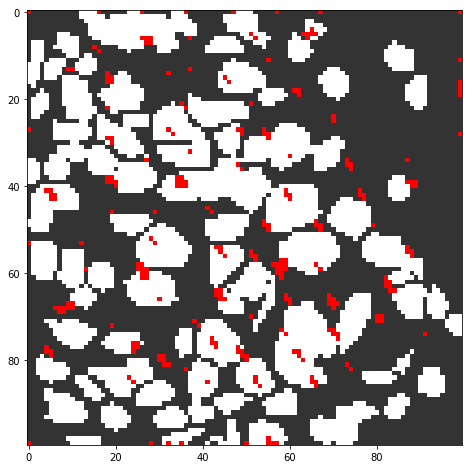|
